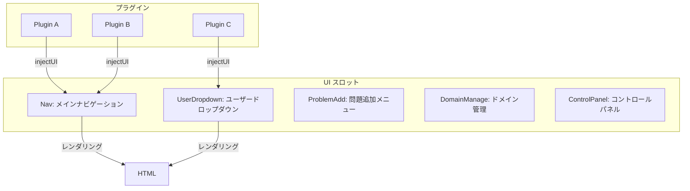

# UI インジェクションシステム

> ソース: `Hydro/packages/hydrooj/src/lib/ui.ts`
> ソース: `Hydro/packages/hydrooj/src/context.ts`

---

## 1. 概要

`ctx.injectUI()` は、HydroOJ のさまざまな UI スロットに
カスタムノード（メニュー項目、ボタン、リンク）を追加するための API。



---

## 2. injectUI のシグネチャ

```typescript
ctx.injectUI(
  slot: UIInjectableFields,       // 注入先スロット
  name: string,                    // ノード名 (ユニーク)
  args?: Record<string, any> | ((handler: Handler) => Record<string, any>),
                                   // テンプレート引数 or ファクトリ関数
  ...permPrivChecker: PermPrivChecker
                                   // 権限チェッカー (省略可)
): void
```

---

## 3. スロット一覧

```typescript
type UIInjectableFields =
  | 'ProblemAdd'       // 問題作成ドロップダウン
  | 'Notification'     // 通知エリア
  | 'Nav'              // トップナビゲーションバー
  | 'UserDropdown'     // ユーザーアイコンのドロップダウン
  | 'DomainManage'     // ドメイン設定の管理メニュー
  | 'ControlPanel'     // コントロールパネル
```

---

## 4. 使用例集

### 4.1 Nav への追加 (静的な引数)

```typescript
ctx.injectUI('Nav', 'typing_main', {
  icon: 'keyboard',       // アイコンクラス
  displayName: 'Typing',  // 表示名
  prefix: 'typing',       // URL プレフィックス (アクティブ判定用)
}, PRIV.PRIV_USER_PROFILE);
```

### 4.2 Nav への追加 (動的な引数)

```typescript
ctx.injectUI('Nav', 'record_main', {
  prefix: 'record',
  query: (handler) => handler.user.hasPriv(PRIV.PRIV_USER_PROFILE)
    ? { uidOrName: handler.user._id }
    : {},
}, PRIV.PRIV_USER_PROFILE);
```

### 4.3 UserDropdown への追加

```typescript
ctx.injectUI('UserDropdown', 'blog_main', (h) => ({
  icon: 'book',
  displayName: 'Blog',
  uid: h.user._id.toString(),
}), PRIV.PRIV_USER_PROFILE);
```

### 4.4 ProblemAdd への追加

```typescript
ctx.injectUI('ProblemAdd', 'problem_create', {
  icon: 'add',
  text: 'Create Problem',
});
```

### 4.5 ControlPanel への追加

```typescript
ctx.injectUI('ControlPanel', 'manage_dashboard');
ctx.injectUI('ControlPanel', 'manage_setting');
```

### 4.6 DomainManage への追加

```typescript
ctx.injectUI('DomainManage', 'domain_edit', {
  family: 'Properties',
  icon: 'info',
});
ctx.injectUI('DomainManage', 'domain_user', {
  family: 'Access Control',
  icon: 'user',
});
```

---

## 5. 権限チェッカーの詳細

第4引数以降（可変長）で権限チェッカーを指定する:

```typescript
// PRIV のみ (number)
ctx.injectUI('Nav', 'item', {}, PRIV.PRIV_USER_PROFILE);

// PERM のみ (bigint)
ctx.injectUI('Nav', 'item', {}, PERM.PERM_VIEW_PROBLEM);

// PRIV + PERM (両方満たす必要がある)
ctx.injectUI('Nav', 'item', {}, PERM.PERM_VIEW_PROBLEM, PRIV.PRIV_USER_PROFILE);

// カスタムチェッカー関数
ctx.injectUI('Nav', 'item', {}, (handler) => handler.user._id === 1);

// 複数の PRIV を OR 条件で
ctx.injectUI('Nav', 'item', {}, [PRIV.PRIV_USER_PROFILE, PRIV.PRIV_EDIT_SYSTEM]);

// 複数の PERM を OR 条件で
ctx.injectUI('Nav', 'item', {}, [PERM.PERM_VIEW_PROBLEM, PERM.PERM_VIEW_CONTEST]);
```

### 5.1 ノードの表示条件 (checker 関数)

```typescript
// "(handler) => boolean" の形式
// true を返すとノードが表示される
ctx.injectUI('Nav', 'special', {
  prefix: 'special',
}, (h) => h.user.hasPriv(PRIV.PRIV_USER_PROFILE)
    ? true
    : h.user.hasPerm(PERM.PERM_VIEW_RECORD));
```

---

## 6. ノードの順序制御

`args.before` で特定のノードの前に挿入できる:

```typescript
// 'homepage' ノードの前に 'my-nav' を挿入
ctx.injectUI('Nav', 'my-nav', {
  icon: 'star',
  displayName: 'My Nav',
  prefix: 'my-nav',
  before: 'homepage',  // ← このノードの前に挿入
});
```

---

## 7. args の内容とテンプレート側

### 7.1 Nav の場合

`args` に設定できる主なフィールド:

```typescript
{
  icon?: string;        // アイコンCSSクラス
  displayName?: string; // 表示名
  prefix?: string;      // URL プレフィックス (アクティブ状態判定)
  query?: Record<string, any> | ((handler) => Record<string, any>);
                        // クエリパラメータ
  before?: string;      // このノードの前に挿入
}
```

### 7.2 UserDropdown の場合

```typescript
{
  icon?: string;        // アイコンCSSクラス
  displayName?: string; // 表示名
  uid?: string;         // ユーザーID (URL 用)
  before?: string;
}
```

### 7.3 ProblemAdd の場合

```typescript
{
  icon?: string;        // アイコンCSSクラス
  text?: string;        // 表示テキスト
  before?: string;
}
```

---

## 8. 内部実装

```typescript
// Hydro/packages/hydrooj/src/lib/ui.ts

// ノードは Proxy を使った遅延初期化配列に格納される
export const nodes = new Proxy({}, {
  get(self, key) {
    self[key] ||= [];
    return self[key];
  },
});

// inject 関数はノードを配列に追加
export function inject(
  node: UIInjectableFields,
  name: string,
  args: Record<string, any> = {},
  ...permPrivChecker: PermPrivChecker
) {
  const obj = { name, args, checker: buildChecker(...permPrivChecker) };

  // before が指定されていればその前に挿入
  const idx = obj.args.before
    ? nodes[node].findIndex((i) => i.name === obj.args.before)
    : -1;
  if (idx !== -1) {
    nodes[node] = nodes[node].filter((i) => i.name !== obj.name);
    nodes[node].splice(idx, 0, obj);
  } else {
    nodes[node].push(obj);
  }

  // クリーンアップ関数を返す
  return () => {
    nodes[node] = nodes[node].filter((i) => i !== obj);
  };
}
```

---

## 9. グローバル UI ノードへのアクセス

```typescript
// 任意の場所から UI ノードを取得
import { getNodes } from 'hydrooj';
// または global.Hydro.ui.getNodes

const navNodes = global.Hydro.ui.getNodes('Nav');
// → [{ name: 'homepage', args: { prefix: 'homepage' }, checker: ... }, ...]
```

---

## 10. 注意点

1. **ノード名の重複**: 同じ名前のノードは `before` 指定時に自動的に重複除去される。
   通常の追加時は重複が許容される（同じノードが複数表示される可能性がある）。

2. **ファクトリ関数の評価タイミング**: `args` にファクトリ関数を渡した場合、
   関数は**リクエストごとに**（テンプレート描画時に）評価される。
   静的な値はプラグインロード時に1度だけ評価される。

3. **権限チェッカーの評価タイミング**: 権限チェッカーもリクエストごとに評価される。
   そのため `handler.user` などのリクエスト依存の情報が利用できる。

4. **プラグインアンロード時**: `injectUI` は `ctx.effect()` でラップされているため、
   プラグインがアンロードされると自動的にノードが削除される。
