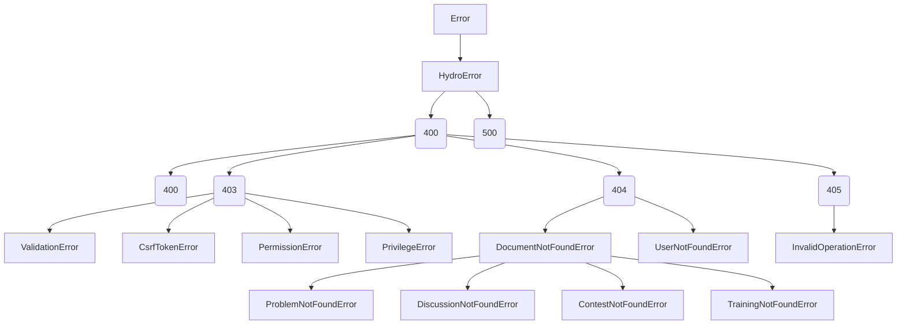

# エラークラス階層とエラーハンドリング

> ソース: `Hydro/framework/framework/error.ts`
> ソース: `Hydro/packages/hydrooj/src/error.ts`
> ソース: `Hydro/packages/hydrooj/src/service/server.ts` (onerror)

---

## 1. エラークラス階層



### 1.1 HydroError (基底)

```typescript
export class HydroError extends Error {
  params: any[];         // エラーパラメータ (翻訳用)
  code: number;          // HTTP ステータスコード

  constructor(...params: any[]) {
    super();
    this.params = params;
  }

  msg(): string {
    return 'HydroError';
  }

  get message(): string {
    return this.msg();
  }
}
```

### 1.2 UserFacingError (HTTP 400番台)

ユーザーに表示してもよいエラー。`error.html` テンプレートで表示される。

```typescript
export const UserFacingError = Err('UserFacingError', HydroError, 'UserFacingError', 400);
```

### 1.3 SystemError (HTTP 500番台)

システム内部エラー。`bsod.html` テンプレートで表示される。

```typescript
export const SystemError = Err('SystemError', HydroError, 'SystemError', 500);
```

---

## 2. エラークラス一覧

### 2.1 フレームワーク標準 (@hydrooj/framework)

| クラス | HTTP ステータス | 説明 |
|--------|----------------|------|
| `HydroError` | - | 基底エラークラス |
| `UserFacingError` | 400 | ユーザー向けエラー |
| `SystemError` | 500 | システムエラー |
| `BadRequestError` | 400 | 不正なリクエスト |
| `ForbiddenError` | 403 | アクセス拒否 |
| `NotFoundError` | 404 | リソース未発見 |
| `MethodNotAllowedError` | 405 | 許可されていないHTTPメソッド |
| `ValidationError` | 403 | バリデーションエラー (ForbiddenError のサブクラス) |
| `CsrfTokenError` | 403 | CSRF トークンエラー |
| `InvalidOperationError` | 405 | 無効な操作 (MethodNotAllowedError のサブクラス) |
| `FileTooLargeError` | 403 | ファイルサイズ超過 |

### 2.2 hydrooj パッケージ追加エラー

| クラス | HTTP ステータス | 説明 |
|--------|----------------|------|
| `PermissionError` | 403 | 権限不足 (ドメインレベル) |
| `PrivilegeError` | 403 | 特権不足 (システムレベル) |
| `UserNotFoundError` | 404 | ユーザー未発見 |
| `DocumentNotFoundError` | 404 | ドキュメント未発見 |
| `ProblemNotFoundError` | 404 | 問題未発見 |
| `SolutionNotFoundError` | 404 | 解答未発見 |
| `DiscussionNotFoundError` | 404 | ディスカッション未発見 |
| `ContestNotFoundError` | 404 | コンテスト未発見 |
| `TrainingNotFoundError` | 404 | トレーニング未発見 |
| `AlreadyVotedError` | 403 | 重複投票 |
| `LoginError` | 403 | ログイン失敗 |
| `AccessDeniedError` | 403 | アクセス拒否 |
| `BlacklistedError` | 403 | ブラックリスト登録済み |
| `FileLimitExceededError` | 403 | ファイル制限超過 |

---

## 3. エラーの使い方

### 3.1 基本的なエラーのスロー

```typescript
import { NotFoundError, ForbiddenError, ValidationError, BadRequestError } from 'hydrooj';

// リソース未発見
throw new NotFoundError('score');          // 404 - "NotFoundError"
throw new NotFoundError(domainId, docId);  // 引数は params としてエラーオブジェクトに格納

// アクセス拒否
throw new ForbiddenError();                // 403 - "ForbiddenError"
throw new ForbiddenError('reason');        // 403 - 理由付き

// バリデーションエラー
throw new ValidationError('fieldName');    // 403 - "Field fieldName validation failed."
throw new ValidationError('field1', 'field2'); // 403 - "Field field1 or field2 validation failed."

// 権限エラー
throw new PermissionError(PERM.PERM_VIEW_PROBLEM);  // 403 - ドメイン権限不足
throw new PrivilegeError(PRIV.PRIV_USER_PROFILE);    // 403 - システム特権不足

// 汎用エラー
throw new BadRequestError();               // 400
throw new UserNotFoundError(uid);           // 404 - "User {0} not found."
throw new DiscussionNotFoundError(domainId, did); // 404
```

### 3.2 エラーメッセージとパラメータ

```typescript
// エラー作成時の引数は this.params に格納される
const error = new NotFoundError('score');
error.params;    // ['score']
error.name;      // 'NotFoundError'
error.code;      // 404
error.message;   // 'NotFoundError'
error.msg();     // 'NotFoundError' (オーバーライド可能)

// 一部のエラークラスはメッセージにパラメータを埋め込む
const userError = new UserNotFoundError(42);
userError.message;  // 'User 42 not found.'
```

### 3.3 カスタムエラーの作成

```typescript
import { CreateError } from 'hydrooj';

// 500 エラー (親クラス, 名前, メッセージ)
export const MyCustomError = CreateError('MyCustomError', SystemError, 'Something went wrong');

// 404 エラー (テンプレート引数付き)
export const ScoreNotFoundError = CreateError('ScoreNotFoundError', NotFoundError,
  (this: HydroError) => `Score ${this.params[0]} not found.`);

// 使用例
throw new ScoreNotFoundError(scoreId);
```

---

## 4. エラーハンドリングの流れ

Handler 内でエラーがスローされると:

```
1. ハンドラ実行中に例外発生
2. handler/error/<HandlerName> イベント発行
3. handler/error イベント発行
4. h.onerror(error) が呼ばれる
5. onerror 内でレスポンスを設定:
   - UserFacingError: error.html + 対応HTTPステータス
   - SystemError: bsod.html + 500
   - 未ログイン+権限エラー: ログインページへリダイレクト
   - ドメイン未参加+権限エラー: ドメイン参加ページへリダイレクト
```

### 4.1 デフォルトの onerror 実装 (hydrooj版)

**ソース:** `Hydro/packages/hydrooj/src/service/server.ts:203-238`

```typescript
server.httpHandlerMixin({
  async onerror(error: HydroError) {
    error.msg ||= () => error.message;
    if (error instanceof UserFacingError && !process.env.DEV) error.stack = '';

    // エラーログ出力 (NotFound や nolog フラグがあるものは除く)
    if (!(error instanceof NotFoundError) && !('nolog' in error)) {
      logger.error(`User: ${this.user._id}(${this.user.uname}) ${this.request.method}: ...`, error.msg(), error.params);
    }

    // 未ログイン (uid=0) + 権限エラー → ログインページへ
    if (this.user?._id === 0 && (error instanceof PermissionError || error instanceof PrivilegeError)) {
      this.response.redirect = this.url('user_login', {
        query: { redirect: this.request.path },
      });
    }
    // ドメイン未参加 + 権限エラー → 参加ページへ
    else if (!this.user._dudoc.join && error instanceof PermissionError) {
      this.response.redirect = this.url('domain_join', {
        query: { redirect: this.request.path, target: this.domain._id },
      });
    }
    // 通常のエラーページ表示
    else {
      this.response.status = error instanceof UserFacingError ? error.code : 500;
      this.response.template = error instanceof UserFacingError ? 'error.html' : 'bsod.html';
      this.response.body = {
        UserFacingError,
        error: {
          message: error.msg(),
          stack: error.stack,
          params: error.params,
          name: error.name,
          code: error.code,
        },
        _rawError: error,
      };
    }
  },
});
```

---

## 5. カスタムエラーハンドリング

Handler クラスで独自の `onerror` をオーバーライドできる:

```typescript
class MyHandler extends Handler {
  async onerror(error: HydroError) {
    if (error instanceof ValidationError) {
      // バリデーションエラー → JSON レスポンス
      this.response.template = null;
      this.response.body = {
        error: 'validation_error',
        fields: error.params,
      };
      this.response.status = 400;
    } else {
      // その他のエラー → デフォルト処理
      await super.onerror(error);
    }
  }
}
```

---

## 6. バリデーションエラーの詳細

```typescript
throw new ValidationError('fieldName');
// メッセージ: "Field fieldName validation failed."
// HTTP ステータス: 403 (ForbiddenError のサブクラス)

throw new ValidationError('field1', 'field2');
// メッセージ: "Field field1 or field2 validation failed."

throw new ValidationError('fieldName', null, 'custom message');
// メッセージ: "Field fieldName validation failed. (custom message)"
```

**注意:** `ValidationError` は HTTP ステータス 403 (Forbidden) を返す。
これは「バリデーションに失敗したリクエストは受け入れられない」という意図。
400 (BadRequest) ではないので注意。

---

## 7. エラー監査ログ

```typescript
import { OplogModel } from 'hydrooj';

// 操作ログを記録
await OplogModel.log(this, 'blog.create', { title: 'My Post' });
await OplogModel.log(this, 'blog.delete', this.ddoc);

// スロークエリは自動的に記録される
// (handler の init フェーズが 5秒以上かかった場合)
```

---

## 8. エラーコードマップ

| エラークラス | code | カテゴリ |
|-------------|------|---------|
| `UserFacingError` | 400 | ユーザーエラー (汎用) |
| `BadRequestError` | 400 | 不正リクエスト |
| `ForbiddenError` | 403 | アクセス拒否 |
| `ValidationError` | 403 | バリデーション失敗 |
| `CsrfTokenError` | 403 | CSRF 失敗 |
| `PermissionError` | 403 | 権限不足 |
| `PrivilegeError` | 403 | 特権不足 |
| `FileTooLargeError` | 403 | ファイル超過 |
| `NotFoundError` | 404 | 未発見 |
| `MethodNotAllowedError` | 405 | メソッド不許可 |
| `InvalidOperationError` | 405 | 操作不許可 |
| `SystemError` | 500 | システムエラー |
